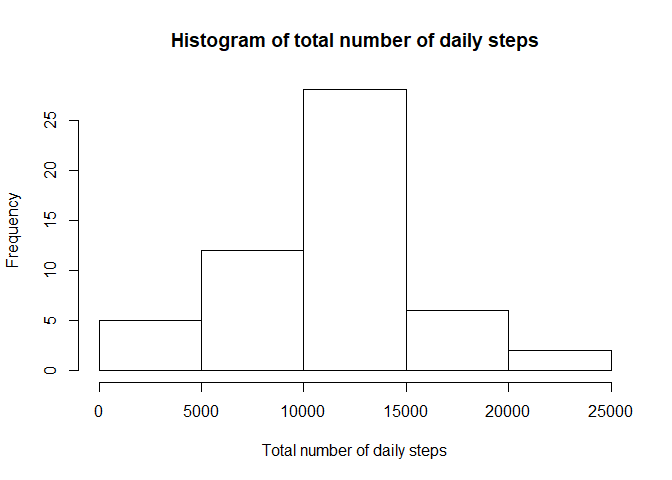
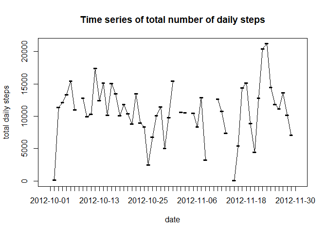
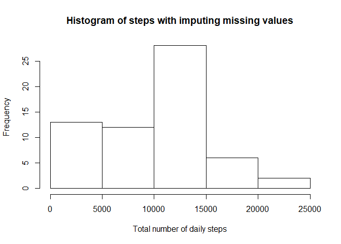
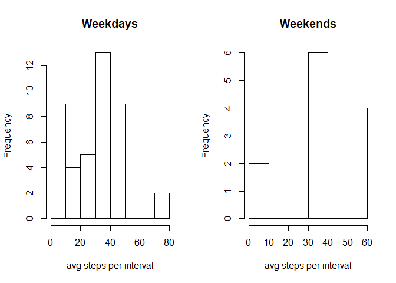

## Loading and preprocessing the data


Loading the packages and reading the data. (Make sure the packages are already installed locally.)


```r
library(dplyr)
```

```
## 
## Attaching package: 'dplyr'
```

```
## The following objects are masked from 'package:stats':
## 
##     filter, lag
```

```
## The following objects are masked from 'package:base':
## 
##     intersect, setdiff, setequal, union
```

```r
library(timeDate)

data <- read.csv('activity.csv')
```

## What is mean total number of steps taken per day?

Creating a histogram of the total number of steps taken daily


```r
daily <- data %>% 
                group_by(date) %>%
                summarise(steps = sum(steps))
```

```
## `summarise()` ungrouping output (override with `.groups` argument)
```

```r
hist(daily$steps, main = "Histogram of total number of daily steps", xlab = "Total number of daily steps")
```

<!-- -->

Where we have a mean number of steps


```r
mean(daily$steps, na.rm = T)
```

```
## [1] 10766.19
```

and a median of


```r
median(daily$steps, na.rm = T)
```

```
## [1] 10765
```


## What is the average daily activity pattern?
A time series of the total number of daily steps is given below

```r
plot(daily$date, daily$steps, main = "Time series of total number of daily steps", xlab = "date", ylab = "total daily steps")
lines(daily$date, daily$steps)
```

<!-- -->

The row for which the interval of steps is highest is presented below

```r
data[which.max(data$interval),]
```

```
##     steps       date interval
## 288    NA 2012-10-01     2355
```


## Imputing missing values

We impute the missing values by replacing all 'na' by 0.


```r
imputed_data <- data
imputed_data[is.na(imputed_data)] <- 0
```

We plot a histogram again of the total number of daily steps, but now with the imputed data


```r
imputed_daily <- imputed_data %>% 
                        group_by(date) %>%
                        summarise(steps = sum(steps))
```

```
## `summarise()` ungrouping output (override with `.groups` argument)
```

```r
hist(imputed_daily$steps, main = "Histogram of steps with imputing missing values", xlab = "Total number of daily steps")
```

<!-- -->


## Are there differences in activity patterns between weekdays and weekends?

And finaly, we want to see if there is a difference in the distribution of the the average number of steps per interval during weekdays and weekends, which is presented in the histograms below.


```r
imputed_avg <- imputed_data %>% 
        group_by(date) %>%
        summarise(steps = mean(steps))
```

```
## `summarise()` ungrouping output (override with `.groups` argument)
```

```r
weekends <- isWeekend(imputed_daily$date)
weekdays <- isWeekday(imputed_daily$date)

par(mfrow = c(1,2))
hist(imputed_avg[weekdays, ]$steps, main = "Weekdays", xlab = "avg steps per interval")
hist(imputed_avg[weekends, ]$steps, xlab = "avg steps per interval", main = "Weekends")
```

<!-- -->


